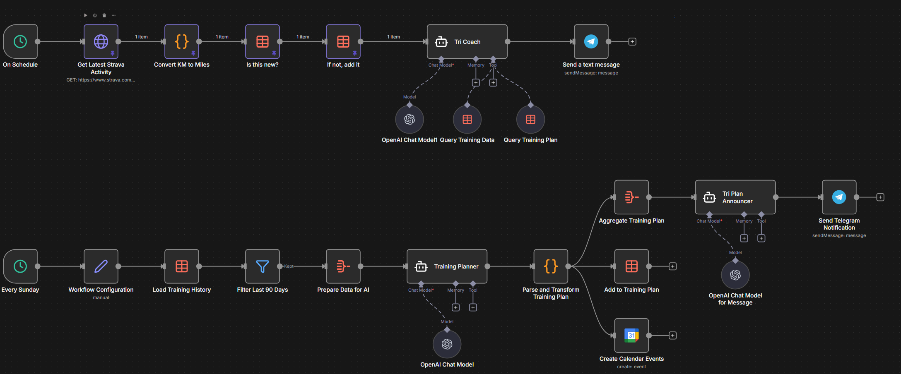

# AI Triathlon Coach - n8n Workflow

An intelligent triathlon coaching system that automatically monitors your Strava activities, provides personalized feedback, and generates weekly training plans using AI.



## Features

- **Automatic Activity Tracking**: Monitors Strava every 5 minutes for new activities
- **AI Coaching Feedback**: Provides personalized coaching feedback after each workout
- **Weekly Training Plans**: Generates science-based 7-day training plans every Sunday
- **Heart Rate Zone Training**: Customized zones based on your physiology
- **Calendar Integration**: Automatically creates Google Calendar events for planned workouts
- **Telegram Notifications**: Instant coaching messages and weekly plan summaries

## What This Workflow Does

### Workflow 1: Activity Monitoring & Coaching (Every 5 Minutes)
1. Checks Strava for new activities
2. Converts metrics to miles and calculates detailed stats
3. Checks if activity is already logged (prevents duplicates)
4. Stores activity in Training data table
5. AI Coach analyzes the workout against your training plan
6. Sends personalized coaching feedback via Telegram

### Workflow 2: Weekly Training Plan (Every Sunday at 3 AM)
1. Loads your training history (last 90 days)
2. Filters data and aggregates for AI analysis
3. AI Planner generates a science-based 7-day training plan
4. Stores plan in Training Plan data table
5. Creates Google Calendar events for each workout
6. Sends weekly plan summary via Telegram

## Prerequisites

Before importing this workflow, you'll need:

### 1. n8n Instance
- Self-hosted n8n or n8n Cloud account
- Access to create data tables and workflows

### 2. API Keys & Accounts
- **OpenAI API Key** - For AI coaching and planning (GPT-5 or compatible model)
- **Strava Account** - To track your activities
- **Telegram Bot** - For notifications
- **Google Account** - For calendar integration (optional)

### 3. Personal Information
- Your weight (for calorie calculations)
- Resting heart rate
- Maximum heart rate
- Target race details

## Setup Guide

### Step 1: Create n8n Data Tables

You need to create two data tables in your n8n instance. See [DATA_TABLES.md](DATA_TABLES.md) for complete schemas.

**Quick Reference:**

1. **Training Table** - Stores Strava activity history
   - Columns: datetime, type, sport_type, distance_miles, duration_minutes, pace_min_per_mile, calories, suffer_score, average_heartrate, max_heartrate

2. **Training Plan Table** - Stores AI-generated weekly plans
   - Columns: date, activity_type, workout, notes

After creating each table, **save the Data Table IDs** - you'll need them in Step 4.

### Step 2: Set Up Strava Integration

1. Go to [Strava API Settings](https://www.strava.com/settings/api)
2. Create a new application:
   - **Application Name**: n8n Tri Coach (or your preferred name)
   - **Website**: Your n8n instance URL
   - **Authorization Callback Domain**: Your n8n instance domain
3. Note your **Client ID** and **Client Secret**
4. In n8n, create a Strava OAuth2 credential:
   - Navigate to **Credentials** > **New**
   - Select "Strava OAuth2 API"
   - Enter Client ID and Client Secret
   - Authorize with Strava

### Step 3: Set Up Telegram Bot

1. Open Telegram and search for [@BotFather](https://t.me/botfather)
2. Send `/newbot` and follow the prompts
3. Choose a name and username for your bot
4. Save the **API Token** provided by BotFather
5. Get your Chat ID:
   - Send a message to your new bot
   - Visit: `https://api.telegram.org/bot<YOUR_BOT_TOKEN>/getUpdates`
   - Look for `"chat":{"id":123456789}` in the response
   - Save this **Chat ID**
6. In n8n, create a Telegram credential:
   - Navigate to **Credentials** > **New**
   - Select "Telegram API"
   - Enter your Bot Token

### Step 4: Set Up OpenAI

1. Get an OpenAI API key from [OpenAI Platform](https://platform.openai.com/api-keys)
2. In n8n, create an OpenAI credential:
   - Navigate to **Credentials** > **New**
   - Select "OpenAI API"
   - Enter your API key

**Note**: This workflow uses GPT-5 models. Ensure you have access and sufficient credits. You can modify the model selection in the OpenAI Chat Model nodes if needed.

### Step 5: Set Up Google Calendar (Optional)

1. In n8n, create a Google Calendar OAuth2 credential:
   - Navigate to **Credentials** > **New**
   - Select "Google Calendar OAuth2 API"
   - Follow the OAuth flow to authorize

Skip this step if you don't want calendar integration. You'll need to remove or disable the "Create Calendar Events" node in the workflow.

### Step 6: Import the Workflow

1. Download `Coach_Template.json`
2. In n8n, go to **Workflows**
3. Click **Import from File**
4. Select `Coach_Template.json`
5. The workflow will import as inactive

### Step 7: Configure the Workflow

#### A. Update All Credential References

Go through each node and assign your credentials:

- **Get Latest Strava Activity** → Select your Strava OAuth2 credential
- **OpenAI Chat Model** nodes (3 total) → Select your OpenAI API credential
- **Send Telegram Notification** & **Send a text message** → Select your Telegram credential
- **Create Calendar Events** → Select your Google Calendar credential (if using)

#### B. Update Telegram Chat IDs

Find and replace `YOUR_TELEGRAM_CHAT_ID` with your actual Chat ID in:
- **Send Telegram Notification** node
- **Send a text message** node

#### C. Update Data Table References

Replace `CONFIGURE_DATA_TABLE_ID` with your actual Data Table IDs in these nodes:
- **Is this new?** → Training table ID
- **If not, add it** → Training table ID
- **Load Training History** → Training table ID
- **Get row(s) in Data table** → Training table ID
- **Get row(s) in Data table1** → Training Plan table ID
- **Add to Training Plan** → Training Plan table ID

#### D. Customize Workflow Configuration

Edit the **Workflow Configuration** node to set:
- `raceDate` - Your target race date (format: YYYY-MM-DD)
- `raceName` - Your race name (e.g., "IRONMAN 70.3 Boulder")
- `raceType` - Race type (e.g., "Half Ironman", "Olympic Triathlon")
- `planningDays` - How many days to plan ahead (default: 7)
- `lookbackDays` - How many days of history to analyze (default: 90)

#### E. Customize Personal Metrics

Edit the **Convert KM to Miles** Code node to update:
```javascript
const USER_WEIGHT_LBS = 200;   // Your weight in pounds
const USER_RESTING_HR = 60;    // Your resting heart rate
const USER_MAX_HR = 190;       // Your maximum heart rate
```

#### F. Customize Heart Rate Zones (Optional)

Edit the **AI Tri Planner** and **AI Tri Coach** nodes to adjust heart rate zones if needed. Default zones:
- Zone 1 (95-120 bpm): Walking and very easy recovery
- Zone 2 (120-145 bpm): Easy aerobic effort
- Zone 3 (145-160 bpm): Moderate effort and easy running
- Zone 4 (160-175 bpm): Tempo/threshold running
- Zone 5 (175+ bpm): Maximum effort and intervals

### Step 8: Test the Workflow

1. **Test Activity Monitoring**:
   - Click on the **Every 5 Minutes** trigger node
   - Click "Execute Node" to test
   - Verify it fetches your latest Strava activity
   - Check if the activity gets added to your Training table
   - Verify you receive a Telegram message with coaching feedback

2. **Test Training Plan Generation**:
   - Click on the **Every Sunday** trigger node
   - Click "Execute Node" to test
   - Verify a 7-day plan is generated
   - Check if workouts are added to Training Plan table
   - Verify calendar events are created (if enabled)
   - Verify you receive a Telegram message with the plan summary

### Step 9: Activate the Workflow

Once testing is successful:
1. Toggle the workflow to **Active**
2. It will now run automatically:
   - Every 5 minutes for activity monitoring
   - Every Sunday at 3 AM for weekly planning

## Customization Options

### Adjust Schedule Triggers

**Activity Monitoring** (default: every 5 minutes):
- Edit the **Every 5 Minutes** node
- Change interval to your preference (e.g., every 10 minutes)

**Weekly Planning** (default: Sunday at 3 AM):
- Edit the **Every Sunday** node
- Change day of week or time as needed

### Modify AI Coaching Prompts

The AI coaching behavior is controlled by system prompts in:
- **AI Tri Coach** - Provides post-workout feedback
- **AI Tri Planner** - Generates weekly training plans
- **Tri Plan Announcer** - Creates motivational summaries

Edit these nodes to customize coaching style, philosophy, or output format.

### Change AI Model

The workflow uses GPT-5 models by default. To use different models:
1. Edit OpenAI Chat Model nodes
2. Select your preferred model from the dropdown
3. Adjust parameters like temperature or reasoning effort as needed

### Disable Calendar Integration

If you don't want calendar events:
1. Delete or disable the **Create Calendar Events** node
2. The workflow will still function normally

## Troubleshooting

### Activities Not Being Logged

- Check Strava API credentials are valid
- Verify the trigger is running (check execution history)
- Check if duplicate detection is working (review Training table)
- Ensure Data Table ID is correct

### No Telegram Messages

- Verify Telegram bot token is correct
- Check Chat ID is accurate
- Test by sending a message to your bot first
- Check Telegram credential in n8n

### AI Responses Not Working

- Verify OpenAI API key is valid and has credits
- Check if you have access to the specified GPT model
- Review OpenAI usage/quota in your OpenAI dashboard
- Check execution logs for error messages

### Data Table Errors

- Verify Data Table IDs are correct
- Check table schemas match the documentation
- Ensure tables exist and are accessible

### Calendar Events Not Created

- Verify Google Calendar OAuth2 credential is authorized
- Check if calendar permissions are granted
- Test calendar node independently

## Data Privacy & Security

This workflow handles:
- Your Strava activity data
- Training metrics and health data
- Personal race information

**Recommendations**:
- Use secure credentials storage in n8n
- Regularly review API access permissions
- Consider self-hosting n8n for maximum data control
- Review OpenAI data policies if privacy is a concern

## Cost Considerations

**OpenAI API Costs**:
- Activity coaching: ~1-2k tokens per workout (~$0.01-0.02 per workout)
- Weekly planning: ~5-10k tokens per plan (~$0.05-0.10 per week)
- Estimated monthly cost: $0.30-$1.00 depending on training volume
  - Light training (10 workouts/month): ~$0.30-0.60
  - Heavy training (30 workouts/month): ~$0.50-1.00

**n8n Costs**:
- Self-hosted: Free (only infrastructure costs)
- n8n Cloud: Check plan limits for executions and data storage

**Other Services**:
- Strava API: Free
- Telegram: Free
- Google Calendar API: Free

## Support & Contributions

This is a community-created workflow template. For issues or questions:
- Review the troubleshooting section
- Check n8n community forums
- Review n8n documentation for node-specific help

## License

This workflow template is provided as-is for personal use. Modify and customize as needed for your training needs.

## Credits

Built with:
- [n8n](https://n8n.io/) - Workflow automation
- [OpenAI](https://openai.com/) - AI coaching and planning
- [Strava API](https://developers.strava.com/) - Activity tracking
- [Telegram Bot API](https://core.telegram.org/bots/api) - Notifications

---

**Ready to get started?** Follow the setup guide above and start your AI-powered triathlon training journey!
